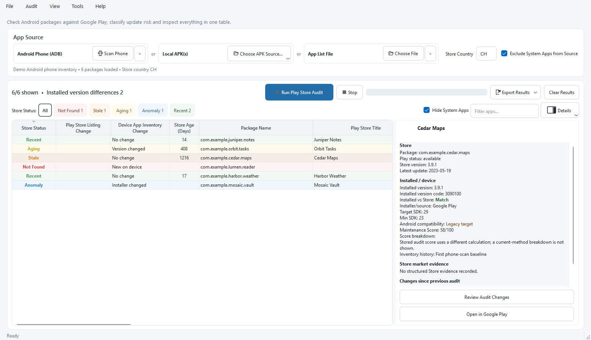
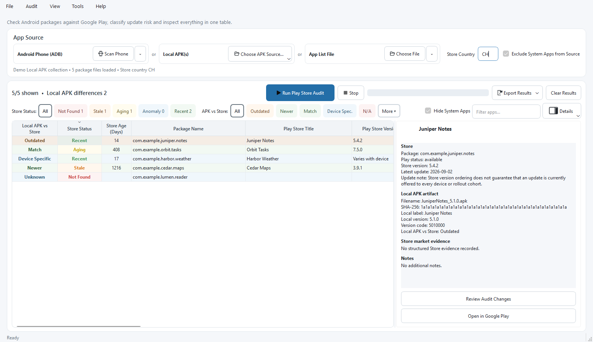
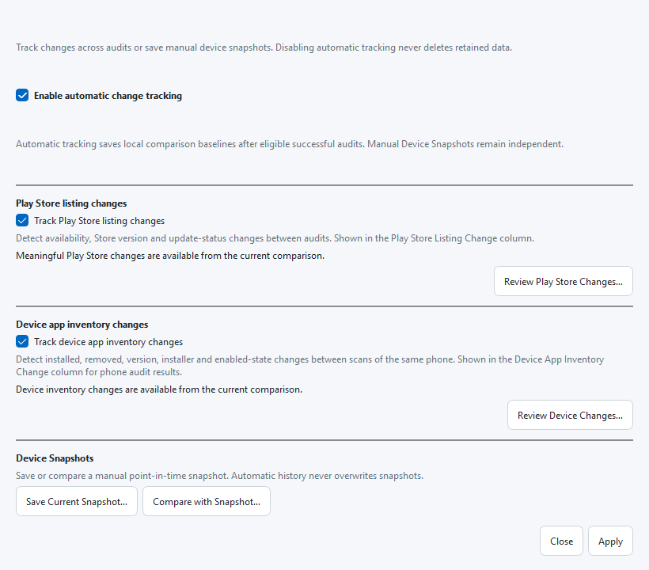
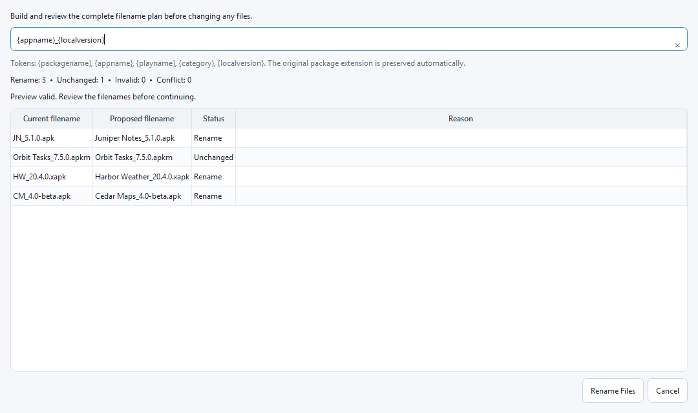

# Store App Audit

*Android App Inventory, Store Analysis & Maintenance Toolkit*

Store App Audit is a cross-platform desktop utility for checking Android package IDs against public Google Play listings. It helps you review Store availability, listing freshness and maintenance signals for imported app lists, local Android package files and packages installed on an Android phone.

The application uses Qt 6 / PySide6 and is not affiliated with or endorsed by Google. The visible product name is **Store App Audit**. For compatibility, the repository, release/update identifiers, executable filename and technical paths continue to use the established `PlayStoreAppAudit` slug.

**Latest published release:** [v2.1.0](https://github.com/mrc-labs/PlayStoreAppAudit/releases/tag/v2.1.0), published for Windows x64/ARM64, Linux x64/ARM64 and macOS Intel/Apple Silicon.

**Current development line:** v2.2 planning. Source-aware table layouts and presets are explicitly scoped in [issue #208](https://github.com/mrc-labs/PlayStoreAppAudit/issues/208); no v2.2 implementation is part of the v2.1 closure work.

The committed vector artwork at `assets/store_app_audit_icon.svg` is the canonical app icon.

## What's new in v2.1

- Rename or remove individual Local APK files, preview collision-safe Mass Rename operations, and guard bulk removal of exact Outdated or Unknown results.
- Resolve Device Specific Store versions through validated profiles and configurable metadata providers without replacing the raw public Store result.
- Capture a privacy-safe, session-only Personal Device profile with **Get Phone Data** through read-only ADB.
- Review clearer source-aware Local APK comparisons, Device Specific/N/A states, and corrected source transitions.
- Use improved theme-aware status presentation plus privacy-safe screenshots in the README and in-app Overview.

See the [v2.1.0 GitHub Release](https://github.com/mrc-labs/PlayStoreAppAudit/releases/tag/v2.1.0) for the complete notes and verified downloads.

## What can you use Store App Audit for?

Store App Audit helps answer practical questions about the Android apps you use, archive or track:

- **Are the apps on my phone still maintained?** Scan a connected Android phone through read-only ADB and spot apps whose Store listings have not been updated for a long time, as well as installed versions that appear behind available Store evidence.
- **Are any of my apps no longer available in the Play Store country I use?** Identify packages that are not found in the Store countries successfully checked, while keeping the result deliberately conservative rather than claiming that an app disappeared globally.
- **Which apps on my phone deserve attention first?** Use freshness, Store availability, installed-vs-Store relationships, Maintenance Score, filters and Smart Queries to triage a large app inventory instead of reviewing every package manually.
- **Is my local APK collection up to date?** Audit individual package files or an entire folder and compare local versions with Store evidence to identify Outdated, Newer, Different, Device Specific or Unknown results.
- **Do I have archived or sideloaded builds that differ from what Google Play currently exposes?** Keep physical package files independent and compare each local artifact with the Store evidence available for its package.
- **Can I audit a list of apps without connecting a phone or keeping APK files?** Import package IDs from CSV, TSV or TXT and review Store availability, freshness, versions and maintenance signals in bulk.
- **What changed since my previous audit or device snapshot?** Use Changes & History to review app inventory changes, Store availability changes, reappeared listings and Store version or update changes.
- **Can I capture an inventory before cleaning up, replacing or troubleshooting a phone?** Scan through read-only ADB and export the resulting inventory and evidence as CSV, HTML or versioned JSON without modifying installed apps.

`Not Found` is intentionally conservative: it means no listing was found in the configured Store countries that were successfully checked; it does not prove that an app has disappeared from Google Play globally.

## Screenshots

These screenshots show the published **v2.1 UI** using fully synthetic fictional apps and package IDs. They are generated reproducibly from the real Qt interface by `tools/generate_canonical_screenshots.py`; no live Store request, connected phone, personal app inventory or third-party app artwork is used.

| Phone maintenance and triage | Local APK / package comparison |
| --- | --- |
| [](docs/images/store-app-audit-phone-maintenance.png) | [](docs/images/store-app-audit-local-apk.png) |
| **Changes & History** | **Mass Rename preview** |
| [](docs/images/store-app-audit-changes-history.png) | [](docs/images/store-app-audit-mass-rename.png) |

These screenshots are included in the immutable v2.1.0 source and packages.

## Key features

- Import package lists from CSV, TSV or TXT files.
- Scan a connected Android phone through read-only ADB and export its current package inventory.
- Select local `.apk`, `.apks`, `.apkm` and `.xapk` package files directly or discover them recursively in a folder.
- Check Google Play availability and update information in a selected Store country.
- Use source-aware Store language and country handling, including Android-device language and configurable fallback countries.
- Classify Store listings as Recent, Aging, Stale, Not Found or Anomaly with configurable freshness thresholds.
- Compare installed or local-package versions with Store evidence using conservative Match / Outdated / Newer / Different / Device Specific / Unknown semantics.
- Inspect results in a source-aware Details Panel with Store, device and local-package evidence.
- Review grouped changes such as app inventory changes, Store availability changes, reappeared listings and Store version/update changes.
- Optionally show Play Store icons and calculate a transparent Maintenance Score heuristic.
- Filter results with search, status chips, Quick Filters and saved one-level All/Any Smart Queries.
- Switch between source-aware Basic, Source Details, Technical and user-controlled Custom column layouts.
- Use conservative cache/recheck behavior, targeted rechecks or an explicit full refresh.
- Compare previous audits and device snapshots under **Tools > Changes & History**.
- Export all or visible results as CSV, HTML or versioned JSON.
- Follow operational state in the native status bar and progress in the results header.

## Current project status

### Published v2.1.0

v2.1.0 is the current public release, frozen at `df2726b959963e5dbb096638d5072bd15eb1de92`. It provides Windows, Linux, and macOS packages for x64 and ARM64 plus consolidated third-party sources and `SHA256SUMS.txt`. Windows/Linux are unsigned; macOS is ad-hoc engineering signed and is not Developer ID signed or notarized. Canonical assembly, checksum validation, and public byte-for-byte re-download verification passed.

See [Project Status](docs/PROJECT_STATUS.md) for the exact release evidence and hashes.

### v2.2 and later planning

v2.1 release work is complete. [Issue #153](https://github.com/mrc-labs/PlayStoreAppAudit/issues/153) remains open through the final editorial PR and post-merge synchronization.

Explicit v2.2 UX scope in [issue #208](https://github.com/mrc-labs/PlayStoreAppAudit/issues/208) covers automatic Local APK columns, separate persistent Custom layouts for phone/App List and Local APK sources, and source-aware built-in presets. Broader arbitrary Named Custom Views remain separate [issue #147](https://github.com/mrc-labs/PlayStoreAppAudit/issues/147).

CLI/headless remains planned for v2.2 through the existing service/domain boundaries. Persistent Personal Device profiles remain separate post-v2.1 issue #200. Safe update delivery is later-2.x issue [#209](https://github.com/mrc-labs/PlayStoreAppAudit/issues/209), linked to signing/notarization trust issue #154; automatic installation is not v2.2 scope.

## Download and installation

Published builds are available from [GitHub Releases](https://github.com/mrc-labs/PlayStoreAppAudit/releases).

For v2.1.0, choose the ZIP matching your operating system and architecture, extract it to a normal folder and start the application from the extracted package.

On Windows, the packaged executable intentionally keeps the compatibility filename `PlayStoreAppAudit.exe`.

Because the Windows v2.1.0 packages are unsigned, Microsoft Defender SmartScreen or another reputation-based check may ask you to confirm that you want to run the application. This reflects signing/reputation status, not an application error. macOS v2.1.0 builds are ad-hoc engineering signed but not notarized, so macOS may also require explicit user approval before first launch.

Verify downloaded files with the release-wide `SHA256SUMS.txt` when integrity matters.

## Quick start

1. Start the application.
2. Choose a CSV/TSV/TXT package list, select Local APK/package file(s) or a folder, or connect an Android phone and select **Scan Phone**.
3. Confirm the Store country. Availability can differ by country.
4. Select the header **Run** button or **Audit > Run Audit**.
5. Use status chips, search, **View > Quick Filters** or **View > Smart Queries** to inspect results.
6. Select a row to inspect Store/device/local-package evidence in the Details Panel.
7. Export complete or currently visible results from **Audit > Export Results**.

A file may contain a `package_name` column, optionally with an `app_name` column, or one Android package ID per row. `sample_packages.csv` shows the simplest supported CSV format.

## Local APK / package workflows

The published v2.1.0 release can audit explicit local `.apk`, `.apks`, `.apkm` and `.xapk` files or recursively discover supported package files in a selected folder. Physical artifact identity remains separate from Android package identity, so multiple files for the same package can remain distinct results.

The local-package path reuses the same Store/provider evidence and result presentation used elsewhere while keeping local metadata such as filename, path, label, local version, SHA-256 and SDK information available in the table and Details Panel.

v2.1 extends this workflow with safe physical-file management. It includes single-file **Rename File…** / **Remove File…**, Mass Rename with metadata templates and a complete validation preview, plus **Remove All Outdated…** / **Remove All Unknown…** with permanent-deletion safeguards. Operations remain physical-path based, preserve unrelated Store/audit evidence, keep duplicate package/SHA files independent, and do not rerun the Store audit after filesystem mutation.

The Local APK direction is inspired by the long-retired [LocalAPK](https://github.com/brz/LocalAPK) utility. Store App Audit is an independent implementation; this acknowledgement refers to product inspiration, not shared code or project affiliation.

## Understanding the results

- **Recent:** listing age is at most the configured Recent maximum, 365 days by default.
- **Aging:** listing age falls between the configured thresholds, 366-730 days by default.
- **Stale:** listing age is above the configured Stale threshold, 730 days by default.
- **Not Found:** no listing was found in the configured countries that were successfully checked; this does not prove global removal.
- **Anomaly:** Store responses were unusual, incomplete or could not be classified confidently.

The optional Maintenance Score summarizes maintenance signals from 0 to 100. It is not a malware, security or trust rating. Its methodology is available from **Help > Maintenance Score Methodology**.

Installed and Local APK versions use a conservative relationship model. `Outdated` is reported only when version evidence establishes ordering; staged and device-specific rollouts can still differ from a simple public Store comparison.

## Android phone and ADB support

ADB access is read-only with respect to installed Android apps. Store App Audit can list packages, inspect device/package metadata and open Android's app-details settings screen. It does not install, uninstall, enable, disable or otherwise modify Android apps.

The application can use an existing ADB executable from `PATH`, common Android SDK locations, `ANDROID_SDK_ROOT` or `ANDROID_HOME`. When no compatible ADB is found, supported hosts can offer a managed download of Google's official Android Platform-Tools archive into the application's local data directory.

Managed Platform-Tools support:

- Windows x64 and ARM64 hosts: Windows archive.
- macOS Intel and Apple Silicon hosts: macOS archive.
- Linux x64: Linux archive.
- Linux ARM64: supply a native ARM64-compatible ADB from the operating system/distribution or Android SDK.

USB debugging and device authorization are required. The in-app **ADB Setup Guide** contains troubleshooting instructions.

Standard Scan Phone captures compact package state. Optional Advanced Settings can collect richer device metadata. A successful scan session can be reused by Run, and Store auditing can continue with captured compact data if the phone is later disconnected. Device Inventory history advances only after a successful audit, not merely after scanning.

## Privacy and network behaviour

Imported files, connected-device metadata, settings, cache entries, audit history, inventory history, snapshots and activity logs are processed and stored locally. Store App Audit has no first-party telemetry or analytics service.

Audits are not completely offline: package IDs, Store country and Store language are used in requests to public Google Play endpoints through the application's Store lookup stack. Optional Store icons are downloaded from HTTPS URLs returned by Store metadata and cached locally. Software update checks contact the public GitHub Releases API. A managed ADB installation, when explicitly approved, downloads Google's official Platform-Tools archive.

Diagnostic bundles are created only when explicitly requested and are not uploaded automatically. Logs, reports and diagnostic bundles can contain local or device-related information, so review them before sharing.

## Platform support

| Platform | Published v2.1.0 | Distribution state |
| --- | --- | --- |
| Windows x64 | ZIP published | Unsigned |
| Windows ARM64 | ZIP published | Unsigned |
| Linux x64 | ZIP published | Unsigned |
| Linux ARM64 | ZIP published | Unsigned |
| macOS Intel / x64 | ZIP published | Ad-hoc engineering signed; not notarized |
| macOS Apple Silicon / ARM64 | ZIP published | Ad-hoc engineering signed; not notarized |

All six final artifacts for a release must derive from the same frozen source SHA. Platform-specific fixes found during the final phase are merged first, then affected targets are revalidated before the final six-platform gate.

## Debug / troubleshooting

Start an explicit source-development debug session with:

```bash
python main.py --debug
```

The session log is written under the active application-data directory in `logs/debug-<timestamp>.log`. The packaged Windows equivalent is:

```text
PlayStoreAppAudit.exe --debug
```

Debug logs are never uploaded automatically and may contain local filesystem paths or filenames.

For cold Local APK performance analysis on a representative folder:

```bash
python tools/profile_local_apk_cold_load.py PATH_TO_APK_FOLDER
```

The profiler uses a temporary empty metadata cache and does not clear the application's normal cache.

## Development

The current source version is `2.1.0`, matching the latest published release. Post-release documentation commits may move `main` beyond the immutable release SHA without changing the v2.1.0 tag or assets.

The current release-development baseline uses Python 3.14, `PySide6-Essentials==6.11.2` and Nuitka 4.2.2. Python 3.15 pre-releases are outside the stable release baseline.

Install the development dependencies, run the application and execute the main source checks with:

```bash
python -m pip install -r requirements-dev.txt
python main.py
python -m compileall playstore_app_audit
python -m pytest
ruff check playstore_app_audit tests main.py
```

Useful references:

- [Architecture](docs/ARCHITECTURE.md)
- [Building and release workflow](docs/BUILDING.md)
- [Mandatory release component freshness gate](docs/RELEASE_COMPONENT_FRESHNESS.md)
- [CI and release maintenance](docs/CI_MAINTENANCE.md)
- [Durable project decisions](docs/PROJECT_DECISIONS.md)
- [Current project status](docs/PROJECT_STATUS.md)
- [Product roadmap](docs/ROADMAP.md)
- [Local APK parser foundation](docs/LOCAL_APK_PARSER.md)
- [Persistent Local APK Library core](docs/LOCAL_APK_LIBRARY.md)
- [Project guidance for coding agents](AGENTS.md)

## Building from source

The current release toolchain uses Python 3.14 and Nuitka standalone packaging. Release artifacts follow an exact-SHA model: source is frozen, platform builds and release assets are validated from that SHA, and tagging/publication happen only after acceptance.

Normal feature work does **not** continuously build every platform. Source tests and Quality run throughout development; packaged Windows x64 evidence is added at deliberate milestones. The final release gate validates all six targets from one exact frozen SHA.

Production signing/notarization is deferred to later 2.x work unless explicitly promoted and proven end-to-end. Do not assume signed/notarized packages simply because a platform build exists.

Platform-specific prerequisites, architecture validation, legal/source handling and release procedures are documented in [Building Store App Audit](docs/BUILDING.md).

## License

The application's own code is licensed under the [GNU General Public License version 3 only](LICENSE) (`GPL-3.0-only`).

GPLv3 permits commercial use provided its terms are followed. An alternative commercial license may be available for organisations or products that need rights beyond GPLv3, such as proprietary redistribution or closed-source integration. See [Commercial licensing](COMMERCIAL-LICENSING.md) and [Licensing model](docs/LICENSING.md).

Third-party components remain under their own licenses. Published releases include the applicable third-party notices/source-availability material; v2.1.0 publishes a consolidated third-party source archive alongside the six binary ZIPs and `SHA256SUMS.txt`.

## Contributing

Contributions are welcome. See [CONTRIBUTING.md](CONTRIBUTING.md) before opening a pull request. Material contributions require acceptance of the project's [Contributor License Agreement](CLA.md).
